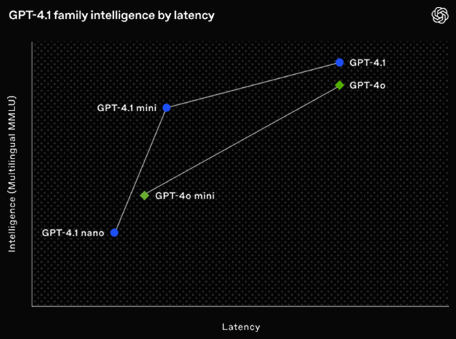

# Node.js GPT Agent (OpenAI Assistant), MCP Platform Template

A TypeScript template for a GPT agent to quickly get started. With this, you can create an Agent or Copilot for your application or project in just a couple of clicks!

A standalone agent designed for rapid integration into any JS application or server, optimized for minimal token costs. 

#### Deploy
It can be deployed on a Node.js server, in a browser, Electron, or any terminal, among others. To create your agent, simply fill out the description and tools as shown in the repository example and specify your OpenAI token.

#### Start
1. Set OpenAI apiKey;
2. Run the command `npm run start` in the project directory;
3. Text directly and assign tasks to the agent right in the terminal!


### OpenAI Assistant
The latest and most efficient OpenAI API using Assistant and gpt-4.1-mini with token caching in the model.



#### Tokens Discount
This agent provides discounted pricing on cached tokens (4 times cheaper and faster compared to manual history management), beneficial for extensive dialogues or parsing large volumes of data.
> Note: OpenAI currently lists this as a Beta API.

Advantages of the OpenAI Assistant used in this project:
1. Compatible with various models; I'm using gpt-4.1-mini at $0.4 per 1M tokens.
2. OpenAI-side caching at $0.1 per 1M tokens, 4 times cheaper than repeated submissions.
3. Accelerated responses due to caching and parsing only the user's latest input.
4. Allows writing custom TS functions, including Node.js support.

### MCP
You can use this template to build your own internal MCP platform.

### Agent Templates
Examples of agents with configured Tools (function_call):
- [rest-agent](src/agents/rest-agent.ts) - for interacting with REST APIs;
- [wttr-agent.ts](src/agents/wttr-agent.ts) - Open API for retrieving weather data from various cities;
- [fs-agent.ts](src/agents/fs-agent.ts) - for local file management and File System interactions;
- [mermaid-agent](src/agents/mermaid-agent.ts) - for generating and sharing diagrams and charts;
- [telegram-manager](src/agents/telegram-manager.ts) - for sending messages from Telegram bots to chats and groups.

### Combine Agents
[gpt-combine-agents.ts](src/gpt/gpt-combine-agents.ts) allows combining agents and sequentially performing complex chains of operations.

### Examples
#### rest-agent
```
U: Send post with body {name: 'john doe'} 
A: The POST request with the body {name: 'john doe'} was sent successfully.

U: Get content
A: HTTP Response
```

#### wttr-agent
```
U: What is the weather like in the capitals of Europe?
A: Here is the current weather in the capitals of Europe:

- London: 6°C
- Paris: 12°C
- Berlin: 4°C
- Rome: 10°C
- Madrid: 6°C
- Vienna: 15°C
- Amsterdam: 5°C
- Brussels: 6°C
- Lisbon: 12°C
- Athens: 22°C

U: Write weather data to files
```


#### telegram-manager
```
U: Send 'Hi!' to chat_id 112414***
A: The message "Hi!" has been sent to chat_id 112414*** using the bot Terminal GPTAgent (@TerminalGPTAgent_bot).
```

#### mermaid-agent
```
U: Create a CJM scheme of interaction user with the bank
A: https://mermaid.live/edit#pako:eNp1kk1T4kAQhv/K1Jxx9eIlB6sgAUVxZQ1q1U48tElDpkxmUvOxisB/tzMEKKg1h1Sm36ff6e70iue6QB7xhYGmZLMkU4yevniyaF7Z2dkVG4h+nqO1bADqnb3gm5UOz/tN87plB4GKxUQvpDrve1eicjIHJ7XqkLhF1qkPPmuWiARs+abBFEfACGS1ZkMxNEYbdk8sLLAjknDLSDxL/GBUkPbKUUUVqPwYuRYzA8rOkRy0wuWReCOmsGQDWVX2KD4WsVYOcsdS3zTauE4dBfW27U37XfA6BO/EUDm6ZH9bgo7q3/neBWjS+s6lqfdYJ0+CfH+otRvOSddb7PcBa0fkDZ5gNwF7EClWSD20/XXKQ1Cm+zKo/Zp+T6dOg/pHdNEfithSj3vq/zWMA5WKuATHPqQrT0aZBn0mHtHq6h+ysbV+l3sbtCeaaMFScm03h/doJ2XBI2c89niNpob2yFdtTsZpzWrMeESfBZj3jGdqQzkNqL9a17s0o/2i5NEcKksn3xTgMJFA235AUBVo4naheHQZHHi04p88uujxJb03Pf4VLC9+XW6+AWjFAA8=

U: Create a super detailed mindmap chart of interaction user with the bank
A: https://mermaid.live/edit#pako:eNp1VE1v2zAM/SuCTi2Qbr304pvrLFiBpMuWbAOGXAiZsYXYkqGPpVnQ/z7Kjmw16y6JSJFPj+Sjz1zoEnnGW6nKFrqdYsxo7W5uvls0d4+gDuxJOTQgnNTq9jYEMLbUlVTDkbEQqaDFaK/B2qM2ZbS3R323oHxtWO5djcpJAQEtBjC2WW0mIwkKKV03XOVCaK8cW4GCCluKiCk/JB7H6zk6kI2d4B6hASVwcmwNKDvUwz5LS4+cxlK6EhyytdF72SQpazRWK2ioF3s9uQutHAG98Q70WAGmTEjk9Nxvgv44R7gck+rRsfXT8+BI2I35c+y0lS55GGydWDWKw1V9ezTR81O6ujRwhCbhs10lHaIEkeB9UY1UI78IxxZepSX1sgg9uX6PsU8v/70K8yBNOd3/p/4LXih8YrqGUzppypZNOtzCYCld3+3JudQQe1d4mm9L5De+67QZgYoa3D8+aJpr3yL/aieZGeepqNxaUg1EVhsU3kg3auhZO7m/KNy+r7q8QeNsSpjW6cq7MODLoESH4u2yrLSSYTM23nZSSO3tIK+EA2PfMJQxoERvXJGljnIh5TmpKvsed3obaXRIuzPeL0FVnuQ9jseQlMUpweEzXhlZ8swZjzNOrW8hmPwccnacVpu+FDyjYwnmsOM79Uo5HahfWrcxzWhf1TzbQ2PJ8v1WziVUBqYQVCWaIhTEs4cegWdn/sKz+xk/0e/rjP/pIe8/PLz+BZh2gIQ=

U: Make a diagram of all the plot arcs and characters of Camus' book "The Plague" for mermaid and publish to mermaid.
A: https://mermaid.live/edit#pako:eNptVEuL2zAQ/iuDTi1kl73sxYXCkrTd9tBs04VCnT1M7LEtIktGD9g0yX/vWLLzNkYaeeb75mltRWFKEpmoLXYNvM4+LTXws5AU3vOZvU/SG9zdfd59lXXj3Q5eFNaBPqTtYwK8orUm5GlL5s+kOgdVDxoxyfabRV3mcU2WU0V2PQGzcuT4BaPPAQtsV2R9PuwJ9Ae1d0CuwI5gFTw4jxsH3kDDjs8JXlCTMpzRKCSKBSlZSxM4SpS+gaJBpUjXVMJqc84w943ReVwT9kcoa5qAC1VF1oEyjlmsaS8cRzkC5sGvLOEaJGc35+TzqfQbMFU8vF3ZTzH0tSgJOTIu1eBK6vrAcNKrCPnJ1UdP3KLf3thNHtfRA5QhgrvoYvCXLHrsd12oUPbYaYMWC89Z5UcxRuAbkhbQFm6An+iZI0VyU5Pm4qYqzsFtutTum7qxkTeVsU1jQY1/skXe7/DURz5kK71EBWZoCtdzkM5g0fZXYHLtpabUBm9DXSvawVFxDXo2XTLnknYo7Q76L7N0uDb/wpbcp9SbiLNUKSq87P+FBTmjQi9fdG3kGGZ0nLBYg8N8nMR/rjiJ6EJzdHhQiAnfEbIUGadPE9GSbbE/im0PWQqejZaWImOxRLteiqXeM6ZD/deYdoTxENSNyCpUjk+hK3lcZxL59jmakC7JTk3QXmSPkUFkW/EusoeJ2PC6n4h/kfLh/nH/HxjYmkI=
```


#### fs-agent.ts
```
U: Create catalogs of the most popular games on Steam from the data you know about the top 10 genres and write them into .md files by genre.
A: Catalogs of the most popular games on Steam by genre have been created and saved into the following .md files:
- Action.md
- Adventure.md
- RPG.md
- Strategy.md
- Simulation.md
- Sports.md
- Indie.md
- Casual.md
- Horror.md
- Multiplayer.md

U: Sparse and summarize data from available files
A: Here's a summarized and sparse overview of the top 10 Steam game genres with examples of their most popular games:
1. Action: Includes intense gameplay titles such as Counter-Strike: Global Offensive, DOOM Eternal, and Hades.
2. Adventure: Story-driven games like The Witcher 3: Wild Hunt, Life is Strange, and Firewatch.
3. RPG (Role-Playing Game): Character progression games including Cyberpunk 2077, Divinity: Original Sin 2, and Dark Souls III.
4. Strategy: Tactics and planning games such as Sid Meier's Civilization VI, Stellaris, and XCOM 2.
5. Simulation: Realistic or creative simulations like The Sims 4, Microsoft Flight Simulator, and Euro Truck Simulator 2.
6. Sports: Sports-themed games including FIFA 21, NBA 2K21, and Rocket League.
7. Indie: Innovative independent games such as Hollow Knight, Celeste, and Stardew Valley.
8. Casual: Easy-to-play fun games like Among Us, Fall Guys, and Candy Crush Saga.
9. Horror: Scary and suspenseful games including Dead by Daylight, Resident Evil 2, and Phasmophobia.
10. Multiplayer: Social competitive games such as Apex Legends, Team Fortress 2, and Dota 2.
```


#### fs-agent.ts + mermaid-agent
```
U: Parse and summarize the data from the available files and create a mindmap chart based on it. Show link and save original scheme in .md file.
A: ...
```
